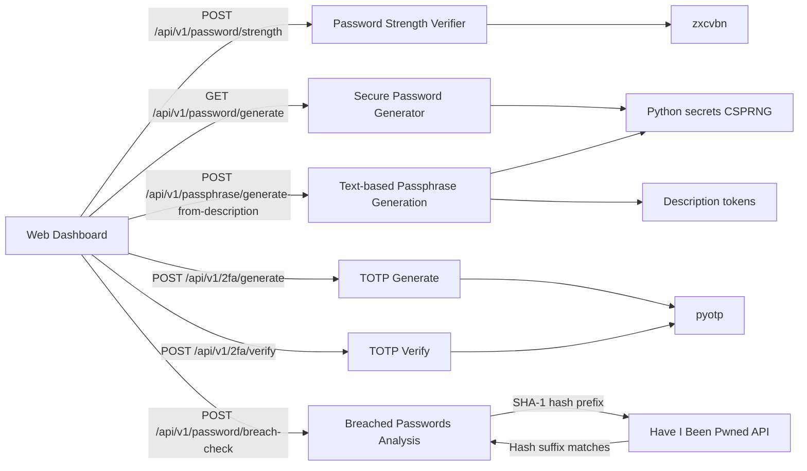

# Password Security Microservice Architecture

```mermaid
flowchart LR
    Client[Web Dashboard] -->|POST /api/v1/password/strength| Strength[Password Strength Verifier]
    Client -->|GET /api/v1/password/generate| Password[Secure Password Generator]
    Client -->|POST /api/v1/passphrase/generate-from-description| TextPassphrase[Text-based Passphrase Generation]
    Client -->|POST /api/v1/2fa/generate| TOTPGenerate[TOTP Generate]
    Client -->|POST /api/v1/2fa/verify| TOTPVerify[TOTP Verify]
    Client -->|POST /api/v1/password/breach-check| Breach[Breached Passwords Analysis]

    Strength --> Zxcvbn[zxcvbn]
    Password --> Secrets[Python secrets CSPRNG]
    TextPassphrase --> Tokens[Description tokens]
    TextPassphrase --> Secrets
    TOTPGenerate --> PyOTP[pyotp]
    TOTPVerify --> PyOTP
    Breach -->|SHA-1 hash prefix| HIBP[Have I Been Pwned API]
    HIBP -->|Hash suffix matches| Breach
```
